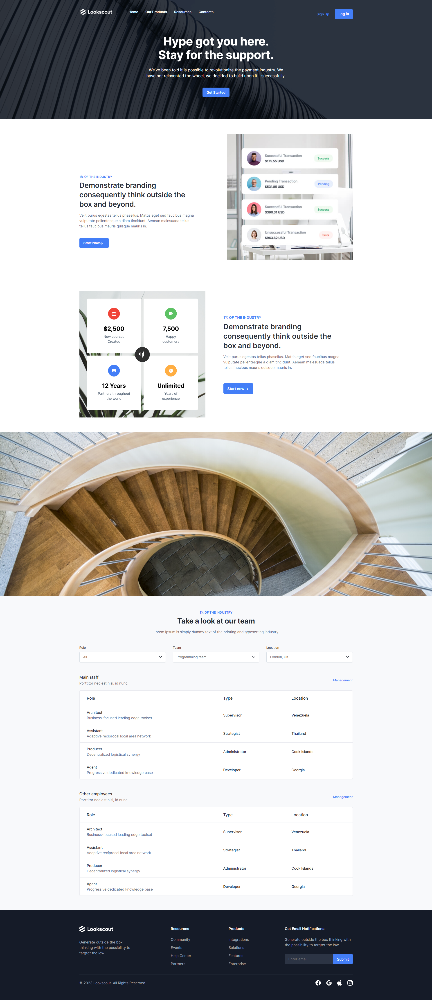

# Takım Projesi - HTML ve CSS Çalışması

Bu proje, 4 kişilik bir takım halinde HTML ve CSS kullanarak yapıldı. Takım arkadaşlarımızla, proje boyunca farklı bölümlerde çalışarak birlikte git kullanmayı etkili bir şekilde öğrenmeyi ve merge işlemleri yapmakta tecrübeli hale gelmeyi amaçladık.

## Projede Görev Aldığım Yerler

- Blog Home sayfasında innerPageNav, stairsImg ve webTable isimli div bölümlerinde görev aldım.
- Blog sayfasında blogHero isimli div kısmında görev aldım

## Proje Açıklaması

Bu projede, temel bir web sitesi oluşturmayı hedefledik. Her takım üyesi, kendisine verilen görevler üzerinde kendi branchlerinde çalışmış ve kodları GitHub üzerinden yönetmiştir.

## Proje Hedefleri

- Git kullanmayı etkili bir şekilde öğrenmek.
- Takım halinde çalışmak.
- Farklı dosyaları birleştirerek merge işlemleri yapmakta tecrübe kazanmak.
- HTML ve CSS becerilerini pratiklemek ve güçlendirmek.

